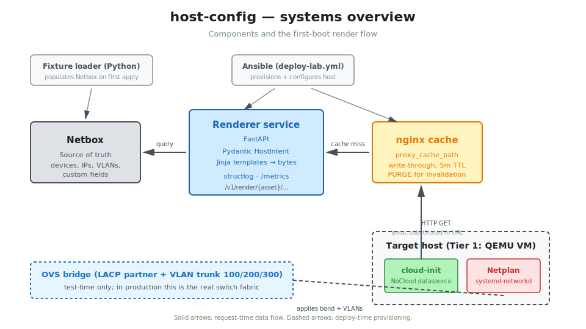
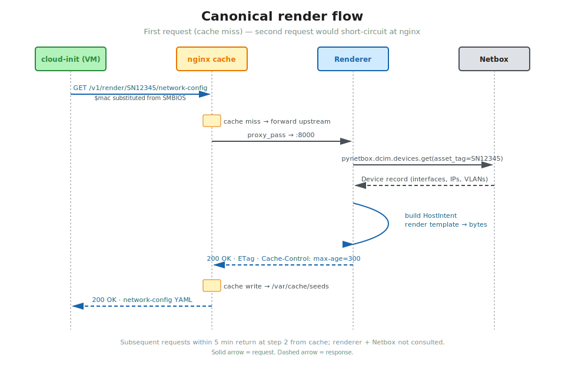

# Systems overview

> Living document. Mirrors [ADR-0011](../adr/0011-systems-overview.md), which captures the load-bearing design decision. Operational details and refinements accrue here; the ADR stays immutable.

## What host-config is

A **renderer**. Given an asset tag, it queries Netbox, builds a typed `HostIntent`, and returns three cloud-init files (`meta-data`, `user-data`, `network-config`). Stateless; no orchestration; no lifecycle awareness.

## What host-config is not

- Not a fleet inventory system (Netbox is).
- Not an orchestrator (out of scope at v1; lives elsewhere when designed).
- Not a UX (lives elsewhere when designed).
- Not a CNI / K8s overlay (future module in this repo, separate from the renderer).

## Components

| Component | Where | What it does |
|---|---|---|
| **Renderer service** | `src/host_config/` | FastAPI service with Pydantic models, Jinja templates, structlog/Prometheus observability. `/v1/render/{asset}/{file}` returns bytes. |
| **nginx cache** | `infra/ansible/roles/nginx-cache/` | `proxy_cache_path` write-through cache (5-min TTL). Stable HTTP endpoint for cloud-init. |
| **Netbox** | `infra/ansible/roles/netbox-dev/` (local dev) | Source of truth for device intent. |
| **Fixture loader** | `fixtures/netbox/populate.py` | Idempotent CLI that populates Netbox with test hosts. |
| **QEMU launcher** | `fixtures/vms/launch.py` | Boots a test VM that exercises the full pipeline. |
| **OVS bridge** | `infra/ansible/roles/ovs-harness/` | Tier 1 only — simulates the upstream switch. Replaced by real fabric in production. |
| **Ansible playbooks** | `infra/ansible/playbooks/` | Provision a DO Droplet + configure the lab on it (`provision.yml` + `deploy-lab.yml`). |

## Canonical first-boot render flow

1. Cloud-init starts on the target VM with kernel cmdline pointing at the nginx URL with `$mac` substituted from SMBIOS.
2. nginx receives the GET. Cache miss → forwards upstream to the renderer.
3. Renderer queries Netbox by asset tag via `pynetbox`.
4. Renderer builds and validates a `HostIntent` via Pydantic.
5. Renderer selects the role-specific Jinja template, renders deterministic bytes.
6. Renderer returns to nginx with `Cache-Control: max-age=300` headers.
7. nginx writes the response to disk cache and forwards to cloud-init.
8. Cloud-init writes the YAML to `/etc/netplan/`, runs `netplan apply`.
9. systemd-networkd brings up bond + VLAN children + east-west NICs (B300 role).

Subsequent requests for the same asset within 5 minutes are served from disk cache without consulting the renderer or Netbox.

## Boundaries (load-bearing)

These are the rules that keep the renderer a clean primitive future systems can build on:

- **Renderer takes an asset tag and returns bytes.** It does not know whether the caller is a test harness, a first-boot, a re-provision, an RMA replacement, or anything else. Caller-domain lifecycle concepts (host status, intent type, environment) never enter the renderer's data model.
- **No upward awareness.** The renderer never queries an orchestrator, never reads lifecycle state, never refuses based on operator-domain concepts.
- **Cloud-init is dumb.** Fetches what it's told. No authentication, no Netbox awareness.
- **nginx is dumb.** Caches HTTP responses. No business logic.
- **Netbox is dumb (from host-config's perspective).** A database we query. Updates flow in from humans, fixtures, or future discovery agents — not from the renderer.

When the orchestrator is designed (future, separate repo), the contract is: orchestrator manages Netbox state and decides when to invoke the renderer; renderer responds with rendered bytes. That separation is preserved by the boundaries above.

## Deferred / future enhancements

Documented so they aren't lost:

- **Distributed tracing (OpenTelemetry)** — adds value when a second service joins (e.g., the orchestrator or the CNI module). See ADR-0009.
- **Mutation testing (`mutmut`)** — adds value after the code surface stabilizes (after M7.5). See ADR-0005.
- **Signed-seed delivery** (HMAC or mTLS) — placeholder reserved in nginx config (M3-4). See ADR-0012 (forthcoming) for the deferred decision.

## Cross-references

- [ADR-0011 systems overview](../adr/0011-systems-overview.md) — the load-bearing decision.
- [Implementation plan](https://github.com/kg-aifabrik/research/blob/main/host-net-config/implementation-plan.md) — the design intent, milestone tracking, and engineering principles.
- [CODE_CONVENTIONS.md](../../CODE_CONVENTIONS.md) — the rulebook for code, tests, logging, and error handling.
